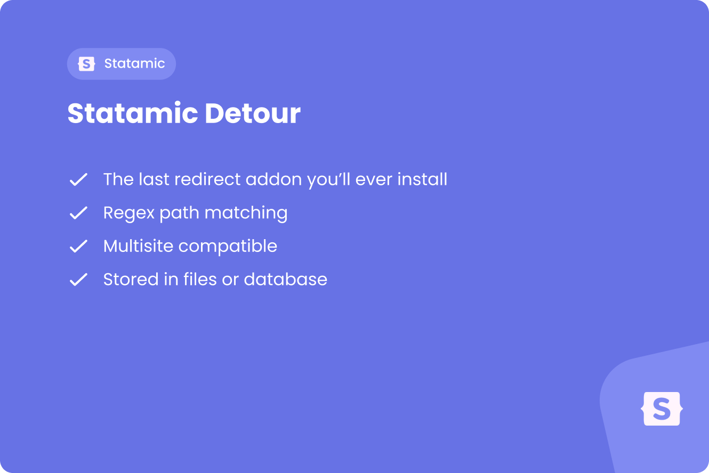

# Statamic Detour
<a href="https://justbetter.nl" title="JustBetter">
    
</a>

This Statamic addon provides a flexible redirect management system for your Statamic projects.

## Requirements

* PHP ^8.3
* Laravel ^12.0
* Statamic ^6.3

## Features

* **Performance Mode**: Ensure redirects are only checked after Statamic determines a route doesn't exist (prevents slowing down valid hits)
* **Multi-Site/Locale Support**: Redirects can be global or scoped to a specific site handle
* **Storage Driver**: Option to store redirects in flat files (YAML) for version control OR Database for performance on massive sites
* **Path & Regex Support**: Create redirects using simple paths or powerful regex patterns
* **Multiple Redirect Codes**: Support for 301, 302, 307, and 308 redirect codes
* **Control Panel Interface**: Manage redirects directly from the Statamic Control Panel

## Installation

You can install this addon via Composer:

```bash
composer require justbetter/statamic-detour
```

## Configuration

You can publish the config by running:

```bash
php artisan vendor:publish --tag=justbetter-statamic-detour
```

You can now find the config file at `config/statamic-detour.php`.

### Storage Driver

The package supports two storage drivers:

#### File Driver (Default)

Store redirects as YAML files in your content directory. This is ideal for version control and smaller sites.

```php
return [
    'driver' => 'file',
    'path' => base_path('content/detours'),
];
```

Or set via environment variable:

```env
STATAMIC_DETOUR_DRIVER=file
```

#### Eloquent Driver

Store redirects in the database. This is recommended for larger sites with many redirects for better performance.

```php
return [
    'driver' => 'eloquent',
];
```

Or set via environment variable:

```env
STATAMIC_DETOUR_DRIVER=eloquent
```

When using the Eloquent driver, run the migrations:

```bash
php artisan migrate
```

### Performance Mode

The package supports two modes for checking redirects:

#### Basic Mode (Default)

Redirects are checked early in the request lifecycle, before Statamic's routing.

```php
return [
    'mode' => 'basic',
];
```

Or set via environment variable:

```env
STATAMIC_DETOUR_MODE=basic
```

#### Performance Mode

Redirects are only checked after Statamic determines a route doesn't exist. This prevents slowing down valid route hits.

```php
return [
    'mode' => 'performance',
];
```

Or set via environment variable:

```env
STATAMIC_DETOUR_MODE=performance
```

### Auto create
Redirects are automatically created whenever an entry's slug is changed. If you change the slug of a parent, this change will also be reflected in its children.

```php
return [
    'auto_create' => true,
];
```

Or set via environment variable:

```env
STATAMIC_DETOUR_AUTO_CREATE=true
```

## Usage

### Creating Redirects

Navigate to **Tools > Detours** in the Statamic Control Panel to manage your redirects.

#### Path Redirects

Create simple path-based redirects:

- **From**: `/old-page`
- **To**: `/new-page`
- **Type**: Path
- **Code**: 301 (or 302, 307, 308)
- **Sites**: Leave empty for global, or select specific sites

#### Regex Redirects

Create powerful pattern-based redirects:

- **From**: `/blog/(\d{4})/(\d{2})/(.*)`
- **To**: `/articles/$1/$2/$3`
- **Type**: Regex
- **Code**: 301
- **Sites**: Select specific sites if needed

### Multi-Site Support

When creating a redirect, you can:

- **Leave Sites empty**: The redirect will apply globally to all sites
- **Select specific sites**: The redirect will only apply to the selected site handles

This allows you to manage redirects per site in a multi-site Statamic installation.

### Storage Considerations

#### File Driver

- Redirects are stored as YAML files in `content/detours/`
- Each redirect is a separate file
- Perfect for version control
- Best for smaller sites (< 100 redirects)

#### Eloquent Driver

- Redirects are stored in the `detours` database table
- Better performance for large numbers of redirects
- Recommended for sites with 100+ redirects
- Supports faster lookups and queries

## Development

When developing this addon, you'll need to build the Control Panel assets. **Node.js 22+** is required for the build process:

```bash
cd /path/to/statamic-detour
npm install
npm run build
```

For hot reloading during development, run `npm run dev` in a separate terminal.

## Quality

To ensure the quality of this package, run the following command:

```bash
composer quality
```

This will execute three tasks:

1. Makes sure all tests are passed
2. Checks for any issues using static code analysis
3. Checks if the code is correctly formatted

## Credits

- [Bob Wezelman](https://github.com/BobWez98)
- [Niek Boon](https://github.com/niekboon)
- [All Contributors](../../contributors)

## Contributing

Please see [CONTRIBUTING](.github/CONTRIBUTING.md) for details.

## Security Vulnerabilities

Please review [our security policy](../../security/policy) on how to report security vulnerabilities.

## License

The MIT License (MIT). Please see [License File](LICENSE) for more information.

<a href="https://justbetter.nl" title="JustBetter">
    
</a>
